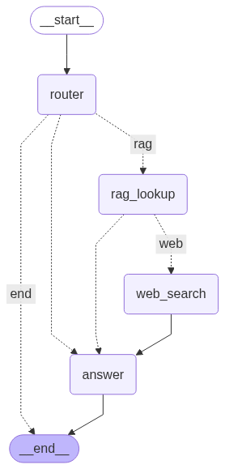
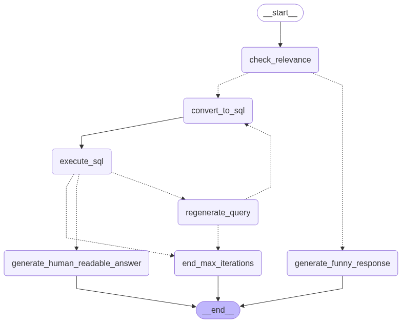

# Smart Shop AI Assistant 🛒

A smart AI assistant that helps shop owners manage their business by understanding both documents and database information through natural language conversations.

## 🎯 What Does This Project Do?

This project solves a common problem for small business owners:
- **Problem**: Shop owners have lots of invoices, bills, and business data scattered everywhere
- **Solution**: One smart assistant that can read documents AND query databases using simple English

## 🏗️ Project Architecture

### Overall System Design


### 🤖 Two Smart Agents Working Together

#### 1. RAG Agent (Document Expert) 📄


**What it does:**
- Reads and understands your business documents (invoices, bills, receipts)
- Answers questions about document content
- Searches through all uploaded files instantly

**How it works:**
- **Step 1**: Upload documents (PDF, Word, Images)
- **Step 2**: AI breaks documents into small chunks
- **Step 3**: Converts chunks into searchable format
- **Step 4**: Stores in vector database for fast searching with some filtering if there in query
- **Step 5**: When you ask questions, finds relevant chunks and if not move to web results
- **Step 6**: Provides answers with source citations

#### 2. SQL Agent (Database Expert) 📊


**What it does:**
- Connects to your business database
- Converts your English questions into database queries
- Gets accurate business insights and reports

**How it works:**
- **Step 1**: You ask a business question in English
- **Step 2**: AI understands what data you need
- **Step 3**: Writes the correct database query
- **Step 4**: Runs the query on your database
- **Step 5**: Returns results in easy-to-understand format

## 🌟 Key Features

### ✅ Document Processing
- **Multi-format support**: PDF, DOCX, PPTX, JPG, PNG
- **Smart text extraction**: Gets text from any document type
- **Automatic chunking**: Breaks large documents into manageable pieces
- **Vector search**: Find information semantically, not just keyword matching

### ✅ Database Intelligence
- **Natural language queries**: Ask questions in plain English
- **SQL generation**: Automatically creates correct database queries
- **Error handling**: Fixes query mistakes automatically
- **Business insights**: Get sales, inventory, and customer analytics

### ✅ Smart Routing
- **Auto-detection**: Knows whether to search documents or database
- **Context awareness**: Understands what type of question you're asking
- **Unified interface**: One chat box for everything

### ✅ Web Interface
- **Easy file upload**: Drag and drop documents
- **Real-time chat**: Instant responses to your questions
- **Source citations**: Shows where answers come from
- **Agent selection**: Choose which AI to use manually

## 🛠️ Technology Stack

### Core AI Technologies
- **LangGraph**: Controls the flow of AI agents
- **LangChain**: Connects different AI components
- **Vector Database**: PostgreSQL with pgvector extension
- **Document Processing**: Docling for text extraction

### AI Models Supported
- **Google Gemini**: Primary AI model (gemini-2.0-flash)
- **Groq**: Fast inference (llama3-70b-8192)
- **Ollama**: Local AI models (llama3.2)

### Web Framework
- **Streamlit**: User-friendly web interface
- **FastAPI**: Backend API for agent communication

## 📁 Project Structure

```
smart_shop_ai/
├── 📱 app.py                    # Main Streamlit web interface
├── ⚙️ config.py                # AI model and database settings
├── 🚀 main.py                  # FastAPI backend server
├── 📋 requirements.txt         # All required Python packages
│
├── 🤖 agents/                  # AI Agent Systems
│   ├── 📄 rag_agent/          # Document processing agent
│   │   ├── langgraph_agent.py  # RAG workflow logic
│   │   ├── nodes.py           # Individual processing steps
│   │   ├── tools.py           # Document search tools
│   │   └── shared.py          # Data structures
│   │
│   └── 📊 sql_agent/          # Database query agent
│       ├── langgraph_agent.py  # SQL workflow logic
│       ├── nodes.py           # Query processing steps
│       ├── tools.py           # Database connection tools
│       └── shared.py          # Data structures
│
├── 🛠️ utils/                   # Helper Tools
│   ├── ingestor.py            # Document text extraction
│   ├── chunker.py             # Text chunking logic
│   ├── db_store.py            # Database storage
│   └── main.py                # Utility functions
│
├── 📂 documents/              # Uploaded business documents
└── 🔧 synthetic_Data/         # Test data generation
```

## 🚀 How to Run the Project

### 1. Install Requirements
```bash
pip install -r requirements.txt
```

### 2. Set Up Environment Variables
Create a `.env` file:
```
GOOGLE_API_KEY=your_google_api_key
GROQ_API_KEY=your_groq_api_key
DATABASE_URL=your_postgres_connection_string
```

### 3. Start the Web Interface
```bash
streamlit run app.py
```

### 4. Access the Application
Open your browser to: `http://localhost:8501`

## 💻 How to Use

### Step 1: Upload Documents

- Click "Upload Documents"
- Select invoices, bills, or receipts
- Wait for processing to complete

### Step 2: Ask Questions


**Document Questions:**
- "What items are in the latest invoice?"
- "How much did we spend on office supplies?"
- "Show me all vendor contact information"

**Database Questions:**
- "What were our sales last month?"
- "Which products are running low in stock?"
- "Who are our top 5 customers?"

### Step 3: Get Smart Answers

- Get answers with source citations
- See exactly where information comes from
- Ask follow-up questions for more details

## 🎯 Use Cases

### For Shop Owners
- **Invoice Management**: Quickly find information from any invoice
- **Inventory Tracking**: Know what's in stock without manual checking
- **Sales Analysis**: Understand business performance trends
- **Vendor Management**: Access supplier information instantly

### For Accountants
- **Document Processing**: Extract data from financial documents
- **Expense Tracking**: Categorize and analyze business expenses
- **Report Generation**: Create financial summaries automatically

### For Managers
- **Business Intelligence**: Get insights from data quickly
- **Decision Support**: Access relevant information for decisions
- **Performance Monitoring**: Track KPIs and metrics easily

## 🔧 Configuration Options

### AI Model Selection
```python
# In config.py
GLOBAL_LLM = ChatGoogleGenerativeAI(model="gemini-2.0-flash")  # Default
# GLOBAL_LLM = ChatGroq(model="llama3-70b-8192")               # Fast option
# GLOBAL_LLM = ChatOllama(model="llama3.2")                   # Local option
```

### Database Settings
- **PostgreSQL**: Main database with vector extension
- **Vector Storage**: For document embeddings
- **Connection Pooling**: Efficient database connections

## 🎨 Architecture Workflows

### RAG Agent Workflow


1. **Document Upload** → Extract text content
2. **Text Chunking** → Break into searchable pieces  
3. **Embedding Generation** → Convert to vector format
4. **Vector Storage** → Save in searchable database
5. **Query Processing** → Find relevant document chunks
6. **Answer Generation** → Create response with citations

### SQL Agent Workflow


1. **Question Analysis** → Understand what user wants
2. **Schema Inspection** → Check available database tables
3. **Query Generation** → Write SQL query
4. **Query Execution** → Run on database
5. **Error Handling** → Fix any query issues
6. **Result Formatting** → Present in readable format

## 🔍 Example Interactions

### Document Questions
```
👤 User: "What's the total amount in the latest invoice?"
🤖 Assistant: "The latest invoice (INVOICE_001.pdf) shows a total amount of ₹15,750. 
              This includes 3 items: Office supplies (₹5,250), Equipment (₹8,500), 
              and GST (₹2,000)."
```

### Database Questions
```
👤 User: "Show me sales for last month"
🤖 Assistant: "Last month's sales summary:
              • Total Sales: ₹1,25,000
              • Number of Orders: 45
              • Top Product: Auto Parts Kit (₹25,000)
              • Best Day: March 15th (₹8,500)"
```

## 🚨 Troubleshooting

### Common Issues

**Cannot import agents:**
- Make sure you're in the project root directory
- Run: `python -m agents.sql_agent.main`

**Database connection errors:**
- Check your PostgreSQL is running
- Verify connection string in `.env` file

**Document processing fails:**
- Ensure file format is supported (PDF, DOCX, PNG, JPG)
- Check file size (max 10MB recommended)

**AI responses are slow:**
- Try switching to Groq model for faster responses
- Check your internet connection for cloud models

## 🤝 Contributing

1. Fork the repository
2. Create a feature branch: `git checkout -b feature-name`
3. Make your changes
4. Test thoroughly
5. Submit a pull request

## 📝 License

This project is open source and available under the MIT License.

## 📞 Support

For questions or issues:
- Create an issue on GitHub
- Check the troubleshooting section above
- Review the documentation in each module

---

**Made with ❤️ for small business owners who want to work smarter, not harder!**
